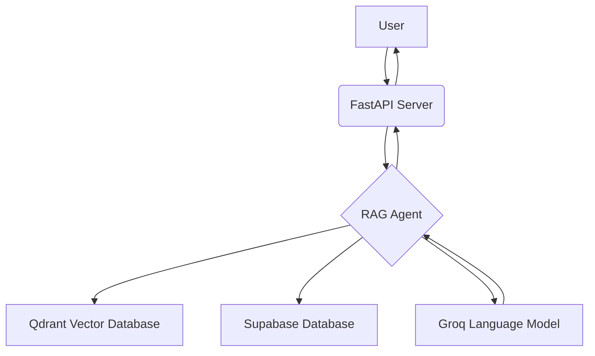
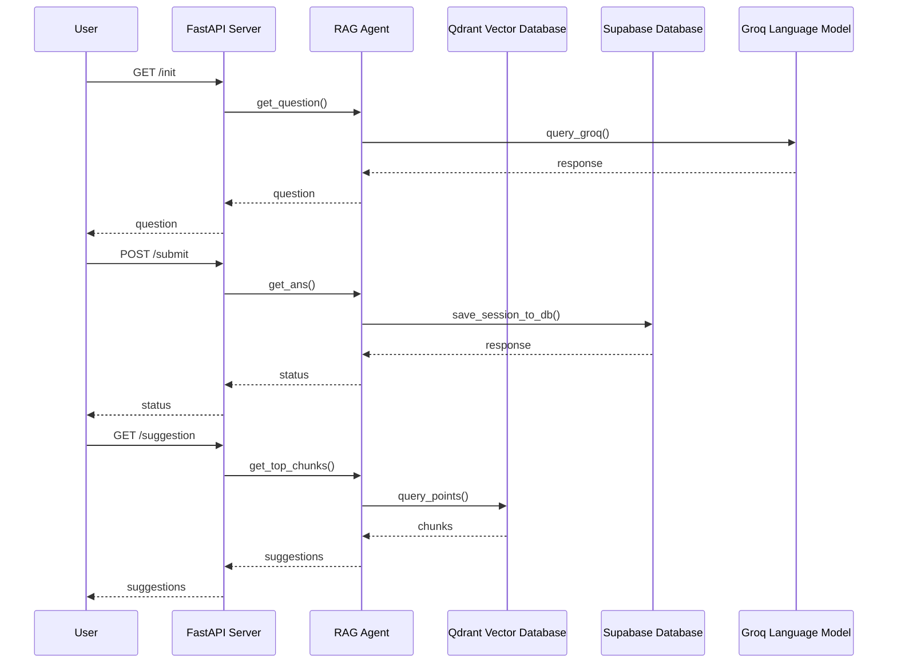

# Architecture Overview

This document provides a high-level overview of the Slash RAG Agent's architecture.

## 1. System Architecture

The Slash RAG Agent is a web-based application that consists of the following components:

- **FastAPI Server:** A Python web server that exposes the agent's functionality through a RESTful API.
- **RAG Agent:** The core of the application, which is responsible for managing the conversational flow, interacting with the Qdrant vector database, and generating gift suggestions.
- **Qdrant Vector Database:** A vector database that stores the embeddings of the gift experiences.
- **Supabase Database:** A PostgreSQL database that stores the session data.
- **Groq Language Model:** A large language model that is used to generate responses to the user's questions.

## 2. Data Flow

The following diagram illustrates the data flow between the different components of the system:

## 3. Execution Flow

The following diagram illustrates the execution flow of the system:

